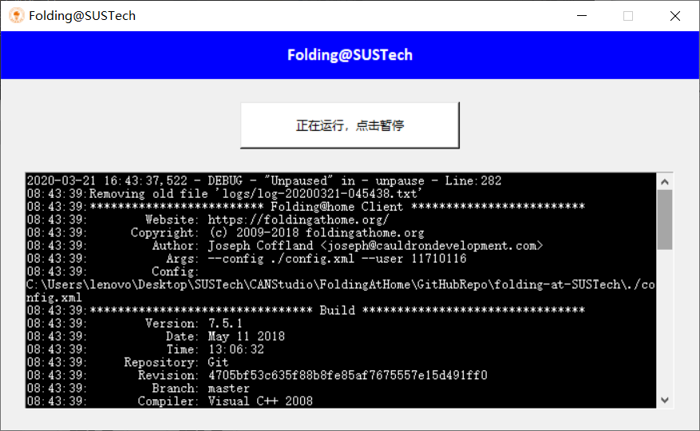

# Folding@SUSTech


**Folding@SUSTech** is a project thriving to further automate the set up process for using [Folding@home](https://foldingathome.org/). *CANStudio* from SUSTech tries to make sure that the users have rather easy access to the *FAHClient* with better connection in mainland China, through the Folding@SUSTech GUI.

<br />

## Team SUSTech in Folding@home

-   Team-id: **236305** (SUSTech).
-   Using student id as identity brings bonus points

<br />

## Environment & Dependencies

-   Python 3.7.5
-   [`cx_Freeze`](https://anthony-tuininga.github.io/cx_Freeze/index.html)
-   [TunSafe](https://tunsafe.com/)
-   [Folding@home](https://foldingathome.org/)

<br />

## Features of the Wrapper GUI

-   Simple identification process for team SUSTech’s registration (with selectable “Anonymous” option), automatically register the user to team SUSTech
-   Easy Pause/Unpause control
-   Keeps track of FAHClient’s log
-   provides stable connection using [SUSTech server configurations](https://github.com/SUSTech-CANStudio/folding-at-SUSTech-server)

<br />

## Quickly Setup

Find the installer [FASUSTech.exe](FASUSTech.exe). Refer to the following two documents. If you need an English copy, feel free <a href="mailto:11710403@mail.sustech.edu.cn">contact us</a>.

-   [安装说明 (Setup Guidance)](安装说明.md)
-   [使用说明 (How-to-Use Guidance)](使用说明.md)

<br />

## Run Python Source File

Main File:  [folding@SUSTech.py](folding@SUSTech.py) 

```bash
python folding@SUSTech.py
```

<br />

## Build using `pyinstaller`

For more details, refer to https://www.pyinstaller.org/

```bash
pyinstaller -F -i icon.ico folding@SUSTech.py
```

then take the `.exe` file in `dist/` out to the root directory and execute.

<br />

## Build using `cx_Freeze`

For more details, refer to https://anthony-tuininga.github.io/cx_Freeze/index.html

Setup File:  [setup.py](setup.py) 

```bash
python setup.py build
```

then take the inner files inside `build/` out (some `dll`s, `.exe`, and dependent libraries) to the root directory and execute.

<br />

## License

-   [**GPL 3.0**](LICENSE)