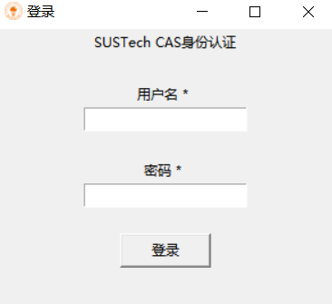

1. 在桌面找到FAS_GUI并双击打开

   

2. 此时可以看到蛋白质折叠计算的后台程序以及身份验证窗口

   

3. 点击认证身份，输入CAS账号和密码，再点击登录

4. 可以看到后台已经开始运行，并且可以随时暂停

   

5. 若网络状况不理想，可以打开桌面的TunSafe，选择SUSTech，再点击Connect

   

6. 恭喜你，你已经称为Folding@SUSTech大家庭中的一员，开始推动蛋白质折叠计算的科研进展！

## 探索更多

在桌面的右下角，可以看到Folding@home程序的小图标

右键点击展开选项

其中Full, Medium, Light为控制算力的选项。若选择Full，则会调度大量计算机资源，可以完成更多的计算任务，但可能会导致计算机不流畅，建议不使用计算机的时候开启。若选择Light，则会调度少量的计算机资源完成小额的计算任务。以此推类，选择Medium则调度适中的计算机资源。

点击Advanced Control查看更多的设置。详情请见：https://foldingathome.org/

点击Protein Viewer可以观看蛋白质的模型。