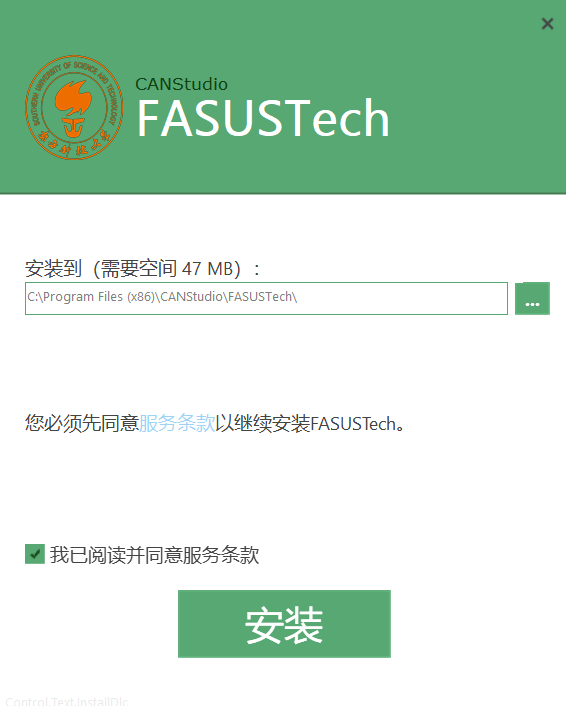
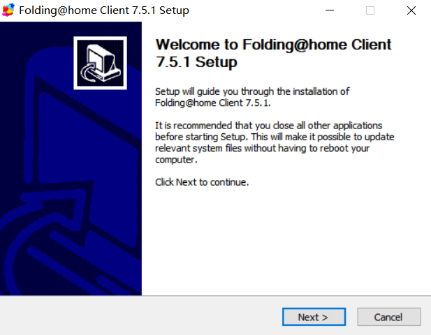
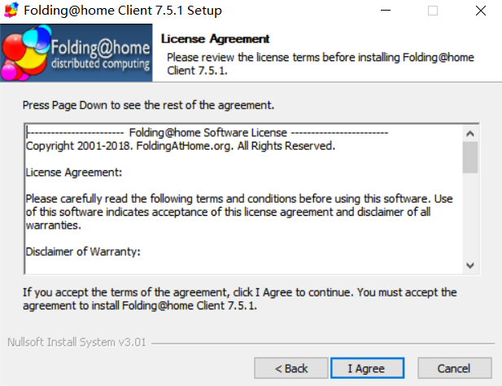
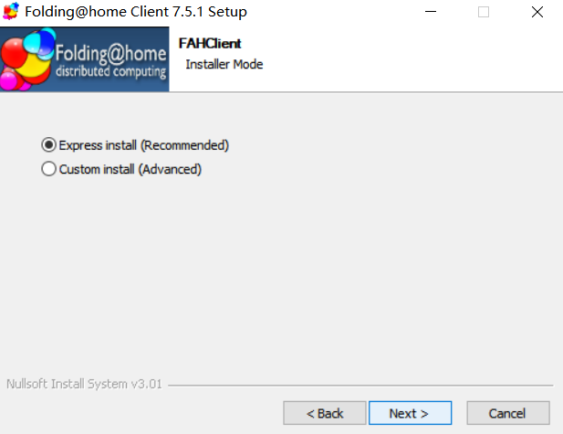
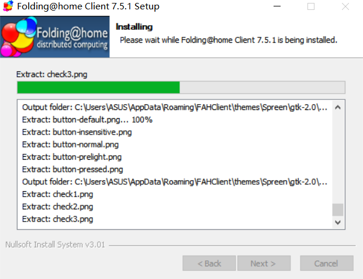
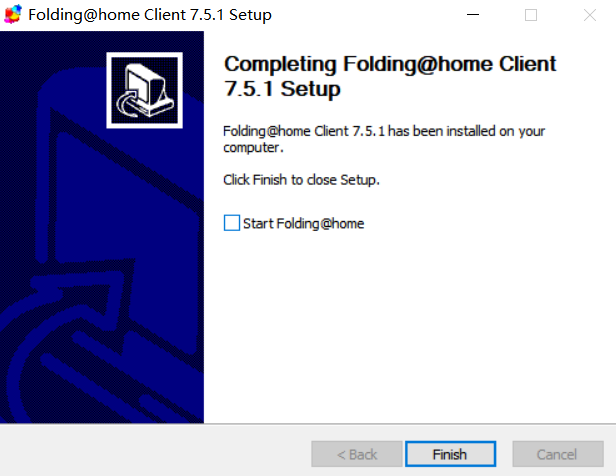
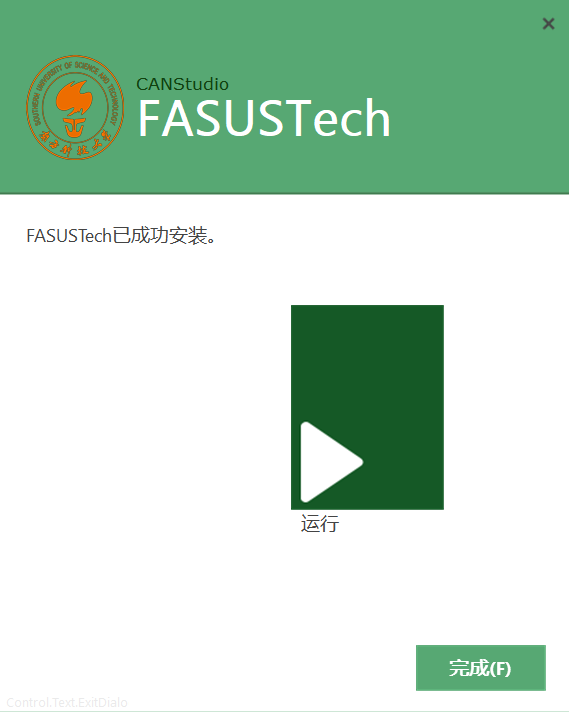

1. 打开下载好的FASUSTech安装及卸载工具

2. 点击安装

   

3. 安装的过程中会有Folding@home的客户端安装包弹出，点击Next安装

   

4. 点击I Agree

   

5. 点击Next

   

6. 等待安装完成

   

7. 取消勾选 Start Folding @home，点击Finish

   

8. FASUSTech成功安装

